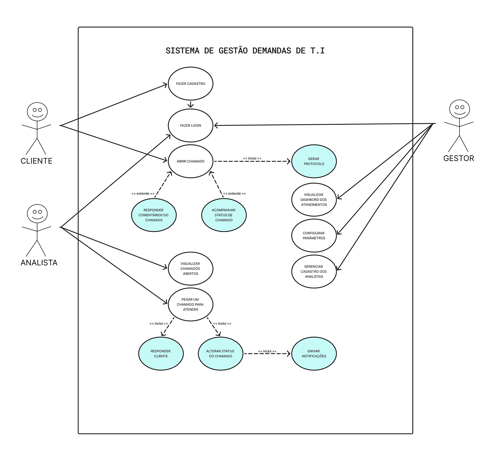

# Especificação do projeto

Nesse tópico abordaremos a definição do problema e da solução proposta para o projeto, a partir da perspectiva do usuário. Nesta seção, serão descritos:

**Personas:** Perfis fictícios que representam os usuários do sistema, com base em dados reais.

**Histórias de usuários:** Descrições curtas que detalham as necessidades e expectativas dos usuários em relação ao sistema.

**Requisitos funcionais e não funcionais:** Características e funcionalidades essenciais do sistema, além de requisitos relacionados à performance, segurança, etc.

Pré-requisitos: <a href="01-Contexto.md"> Documentação de contexto</a>

## Personas

Analisando o escopo do projeto, definimos as seguintes personas:

  

**Carlos, o Servidor:**  
Carlos tem 35 anos e é um servidor público da PBH que trabalha no setor de Recursos Humanos. Ele precisa abrir e acompanhar chamados técnicos relacionados às suas atividades nos sistemas de RH. Sua maior frustração é a falta de atualizações rápidas sobre o status dos chamados, o que frequentemente o deixa sem respostas para demandas urgentes. Carlos valoriza um sistema que seja simples de usar e que forneça notificações automáticas sobre o progresso de suas solicitações.

---

  

**Mariana, a Analista:**  
Mariana tem 28 anos e é uma analista de TI da ASTIN. Ela gerencia um grande volume de chamados diariamente e precisa de ferramentas para organizar, priorizar e responder às solicitações de forma eficiente. Sua maior frustração é o excesso de chamados que chegam por e-mail, sem um sistema de priorização adequado, o que a obriga a gastar tempo organizando manualmente as demandas. Mariana busca um sistema que permita filtrar chamados, atribuí-los a si mesma e manter uma comunicação clara com os solicitantes.

---

  

**Roberto, o Gestor:**  
Roberto tem 45 anos e é gerente da ASTIN. Ele supervisiona uma equipe de analistas e precisa monitorar o desempenho da equipe, identificar gargalos e obter métricas detalhadas sobre os atendimentos. Sua maior frustração é a dificuldade em consolidar dados de diferentes fontes para gerar relatórios gerenciais. Roberto valoriza um sistema que ofereça dashboards intuitivos e relatórios históricos para apoiar a tomada de decisões estratégicas.

---

  

**Ana, a Servidora Multitarefa:**  
Ana tem 42 anos e trabalha no setor financeiro da PBH. Além de suas responsabilidades diárias, ela frequentemente precisa abrir chamados técnicos para resolver problemas nos sistemas de pagamento. Sua maior frustração é a falta de clareza nas respostas dos analistas, o que a obriga a repetir informações. Ana valoriza um sistema que centralize o histórico de interações e permita anexar documentos relevantes para agilizar o atendimento.

---

  

**Joana, a Analista Júnior:**  
Joana tem 24 anos e começou recentemente a trabalhar na ASTIN. Ela ainda está se familiarizando com os processos internos e frequentemente precisa de suporte para entender como priorizar e resolver chamados. Sua maior frustração é a falta de um sistema que facilite a colaboração com colegas mais experientes. Joana valoriza um sistema que permita compartilhar informações e consultar históricos de chamados para aprender com casos anteriores.

---

  

**Eduardo, o Gestor Estratégico:**  
Eduardo tem 50 anos e é diretor de TI da PBH. Ele supervisiona várias equipes, incluindo a ASTIN, e precisa de uma visão consolidada do desempenho geral dos atendimentos. Sua maior frustração é a falta de integração entre os sistemas utilizados pelas diferentes equipes. Eduardo valoriza um sistema que permita configurar parâmetros globais e gerar relatórios comparativos entre equipes para alinhar estratégias de melhoria contínua.

---

## Histórias de usuários

Com base na análise das personas, foram identificadas as seguintes histórias de usuários:

|EU COMO... `PERSONA`        | QUERO/PRECISO ... `FUNCIONALIDADE`           |PARA ... `MOTIVO/VALOR`                    |
|----------------------------|----------------------------------------------|-------------------------------------------|
|**Servidor Público**           | Abrir e acompanhar chamados técnicos         | Resolver problemas dos sistemas de RH rapidamente            |
|**Servidor Público**           | Receber notificações sobre atualizações no chamado | Garantir que estou sempre informado sobre o progresso da minha solicitação |
|**Servidor Público**           | Visualizar o histórico completo de interações no chamado | Consultar informações anteriores para maior clareza e rastreabilidade |
|**Analista de Suporte Técnico** |Organizar, filtrar e responder os chamados rapidamente    | Solucionar as demandas sem atrasos            |
|**Analista de Suporte Técnico** | Atribuir chamados a si mesmo e priorizá-los conforme urgência | Gerenciar melhor meu tempo e atender os chamados mais críticos primeiro |
|**Analista de Suporte Técnico** | Enviar mensagens e anexos diretamente no chamado | Facilitar a comunicação com o cliente e compartilhar informações relevantes |
|**Gerente de TI**               | Obter métricas detalhadas sobre a equipe     | Melhorar a eficiência e tomada de decisão |
|**Gerente de TI**               | Configurar parâmetros do sistema, como níveis de prioridade | Adaptar o sistema às necessidades específicas da equipe |
|**Gerente de TI**               | Visualizar relatórios históricos sobre o desempenho da equipe | Identificar tendências e propor melhorias estratégicas |

## Requisitos

As tabelas a seguir apresentam os requisitos funcionais e não funcionais que detalham o escopo do projeto. Para determinar a prioridade dos requisitos, aplique uma técnica de priorização e detalhe como essa técnica foi aplicada.

### Requisitos funcionais

|ID    | Descrição do Requisito  | Prioridade |
|------|-----------------------------------------|----|
|RF-001| O sistema deve permitir que clientes realizem cadastro informando nome, matrícula, e-mail e gerência, além de fazer login a partir dos dados que o mesmo cadastrou. | 🔴 ALTA | 
|RF-002| O sistema deve permitir que clientes consigam recuperar a sua senha de login caso a esqueça. | 🔴 ALTA | 
|RF-003| O sistema deve permitir que clientes abram chamados informando: assunto, descrição, tipo de demanda e prioridade. O sistema deve gerar automaticamente um número de protocolo. | 🔴 ALTA |
|RF-004| O cliente deve visualizar seus chamados em uma tela dedicada, acompanhando o status da demanda (ex.: aberto, em análise, resolvido). | 🔴 ALTA |
|RF-005| O cliente deve poder enviar mensagens dentro do chamado após sua abertura, permitindo comunicação contínua com o analista. | 🟠 MÉDIA |
|RF-006| O analista deve visualizar todos os chamados em aberto e filtrá-los conforme necessidade. | 🔴 ALTA |
|RF-007| O analista deve poder atribuir um chamado a si mesmo, movendo-o para sua fila de atendimento. | 🔴 ALTA |
|RF-008| O analista deve poder enviar mensagens no chamado e alterar o status da demanda, mantendo o fluxo do atendimento. | 🔴 ALTA |
|RF-009| O gestor deve ser um perfil pré-determinado, responsável por cadastrar e gerenciar os perfis dos analistas e visualizar todos os usuários do sistema. | 🟠 MÉDIA |
|RF-010| O gestor deve poder configurar os parâmetros do sistema, como status das demandas, níveis de prioridade e gerências. | 🟠 MÉDIA |
|RF-011| O gestor deve ter acesso a um dashboard gerencial, exibindo métricas sobre chamados atendidos, chamados em aberto e desempenho dos analistas. | 🟠 MÉDIA |
|RF-012| O sistema deve permitir anexar arquivos nos chamados, possibilitando o envio de documentos e imagens para complementar as solicitações. | 🟢 BAIXA |
|RF-013| O sistema deve notificar clientes e analistas sobre atualizações no chamado, como mudanças de status ou novas mensagens. | 🟢 BAIXA |

### Requisitos não funcionais

|ID     | Descrição do Requisito  |Prioridade |
|-------|-------------------------|----|
|RNF-001| O sistema deve ser desenvolvido utilizando Node.js no backend e React no frontend, garantindo modularidade e escalabilidade. | 🔴 ALTA | 
|RNF-002| O banco de dados deve utilizar MySQL, com estrutura relacional para garantir integridade e eficiência nas consultas. | 🔴 ALTA | 
|RNF-003| O tempo médio de resposta para operações comuns (cadastro de chamados, atualizações, visualizações) deve ser inferior a 2 segundos. | 🟢 BAIXA | 
|RNF-004| O sistema deve possuir uma interface responsiva (Apesar de que na PBH e ASTIN são utilizados apenas aplicações Desktop durante o serviço) | 🟢 BAIXA | 
|RNF-005| O sistema deve permitir autenticação através de JWT e criptografia para proteger os dados dos usuários| 🟠 MÉDIA | 
|RNF-006| O sistema deve possuir suporte aos principais browsers utilizados no mercado hoje, sobretudo Chrome, Edge e Firefox, os mais utilizados no contexto da PBH| 🟠 MÉDIA | 

## Restrições

O projeto está restrito aos itens apresentados na tabela a seguir.

|ID| Restrição                                             |
|--|-------------------------------------------------------|
|001| O sistema não deve depender de serviços pagos para rodar, priorizando ferramentas open-source e opções gratuitas na nuvem para hospedagem e banco de dados. |
|002| Os clientes, os analistas e o gestor não podem excluir chamados, apenas alterá-los ou arquivá-los, garantindo rastreabilidade. |
|003| As funcionalidades do sistema devem estar alinhadas apenas ao escopo da ASTIN, não sendo projetadas para um helpdesk genérico. |
|004| O tempo de desenvolvimento do projeto deve respeitar o prazo da disciplina Trabalho Interdisciplinar: Aplicações para Processos de Negócios da PUC Minas, com entrega final na última sprint. |

## Diagrama de casos de uso

O diagrama de casos de uso abaixo descreve o sistema apresentado e seus três atores principais: **Cliente**, **Analista** e **Gestor**: 

- O **Cliente** pode realizar ações como Cadastrar-se no sistema, Abrir chamado, Acompanhar status do chamado e Responder comentários. 
- O **Analista** tem a capacidade de Visualizar Chamados Abertos, Pegar um chamado para atender, Atualizar status do chamado e Responder ao cliente. 
- O **Gestor** pode Gerenciar cadastro de analistas, Visualizar dashboard e Configurar parâmetros. 

##
