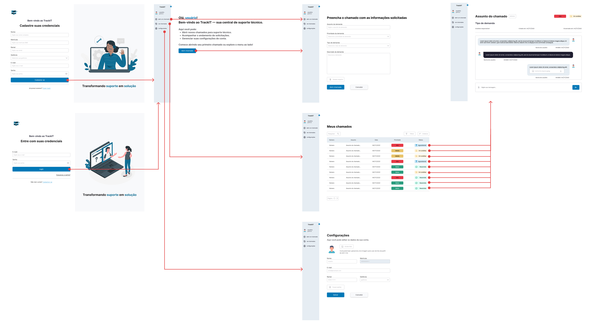

# Projeto de interface

Pré-requisitos: <a href="02-Especificacao.md"> Especificação do projeto</a>

Visão geral da interação do usuário pelas telas do sistema e protótipo interativo das telas com as funcionalidades que fazem parte do sistema (wireframes) para o TrackIT.

 ## User flow - Usuário

 ## User flow - Analista

 ## User flow - Gestor

### Diagrama de fluxo

O diagrama apresenta o estudo do fluxo de interação do usuário com o sistema interativo, muitas vezes sem a necessidade de desenhar o design das telas da interface. Isso permite que o design das interações seja bem planejado e tenha impacto na qualidade do design do wireframe interativo que será desenvolvido logo em seguida.

O diagrama de fluxo pode ser desenvolvido com “boxes” que possuem, internamente, a indicação dos principais elementos de interface — tais como menus e acessos — e funcionalidades, como editar, pesquisar, filtrar e configurar, além da conexão entre esses boxes a partir do processo de interação.

## Wireframes

O wireframe do projeto pode ser visualizado na íntegra através do protótipo interativo no Figma: [Protótipo via Figma](https://www.figma.com/design/mQ01IKXNd8l9l0xQwxCgcQ/wireframe-trackit?node-id=0-1&t=4R3iXTh5kUjHYW4C-1)

## Interface do sistema e telas principais do sistema

As interfaces do sistema seguem um padrão bem definido e organizado. Todas as tela são compostas por uma sidebar expandível que contém as operações que o usuário pode realizar dentro do sistema.

Seguem respectivamente as telas de home para os 3 perfis do sistema: cliente, analista e gestor. As telas de home possuem um botão CTA (call to action), instruindo o determinado perfil de usuário para realizar a principal ação dentro do sistema.

##  Telas do processo

### Cliente

O cliente deve preencher as informações do formulário para conseguir abrir o chamado. Ao criá-lo, o sistema gera automaticamente um número de protocolo, salva no banco de dados e adiciona a fila de chamados não atribuídos, para que os analistas consigam visualizar e atribuir.

O cliente pode visualizar os chamados abertos por ele, de modo a ter uma visão global de quais atendimentos ainda estão pendentes.

O cliente tem à disposição um chat interativo com o analista, de modo que pode conversar e enviar anexos para que a demanda possa ser solucionada.

### Analista

O analista através da seção atribuir chamados consegue visualizar os chamados que estão em aberto, clicar no chamado para ver os detalhes e atribuir o chamado a si mesmo para começar a atender.

O analista consegue conversar com o cliente pelo chamado bem como anexar arquivos e mudar o status do chamado ao decorrer do atendimento.

O analista consegue visualizar todos os chamados que ele se atribuiu, de modo a ter uma visão geral do seu fluxo de trabalho e principais pendências.

### Gestor

O gestor consegue visualizar as métricas do atendimento da equipe. Através de KPIs e gráficos.

O gestor consegue visualizar tanto os chamados em aberto, quanto os da equipe dele, de modo que consiga ter uma visão gerencial e apurada.

O gestor consegue enviar mensagens nos chamados em aberto ou atribuídos e atribuir um chamado em aberto para alguém da equipe dele.

O gestor consegue editar parâmetros utilizados na abertura do chamados e gerências. De modo que possa delimitar o escopo de atendimento de sua equipe.

O gestor consegue criar, editar e excluir pefis do usuário. Essa feature é útil para que ele possa cadastrar os membros de sua equipe.

Existem outras várias telas para cada perfil que podem ser visualizadas através do protótipo interativo no <a href='https://www.figma.com/design/mQ01IKXNd8l9l0xQwxCgcQ/wireframe-trackit?node-id=0-1&t=P2jZDK4UVQqXLUjh-1'>Figma</a> Essas apresentadas são as principais para o funcionamento do sistema.
