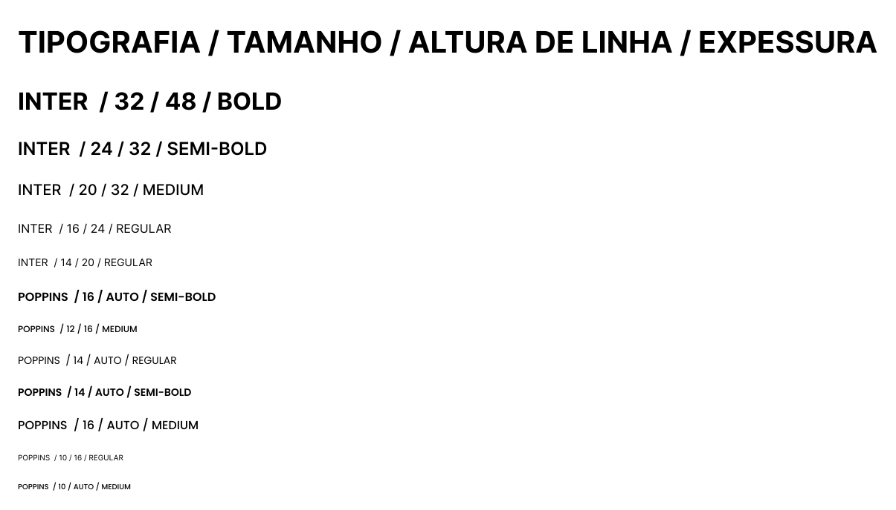

# Template padrão da aplicação

Pré-requisitos: <a href="02-Especificacao.md"> Especificação do projeto</a>, <a href="03-Metodologia.md"> Metodologia</a>, <a href="05-Projeto-interface.md"> Projeto de interface</a>

A aplicação será composta em todas as telas or uma sidebar com as principais ações que o usuário pode executar dentro do sistema. Existem botões CTA para direcionar o tipo de usuário à tarefa principal que ele pode executar no sistema.

## Paleta de Cores:

## Tipografias:

## Logotipo:

### Elementos Visuais Principais:

- Monitor de Computador Estilizado: O elemento central é um monitor, representado de forma simplificada e moderna. Ele possui uma base sólida e uma tela que ocupa a maior parte do ícone. A tela em si tem um tom de azul mais claro ou um gradiente, sugerindo reflexo ou atividade.
- Seta/Curva Ascendente (Swoosh): Sobreposta à tela do monitor, há uma curva branca dinâmica que se transforma em uma seta apontando para cima e para a direita. Ela começa mais fina à esquerda e se alarga sutilmente antes de formar a ponta da seta.

### Paleta de Cores:

- Azul (predominante): Usado em diferentes tons para o monitor. O azul é frequentemente associado à tecnologia, confiança, profissionalismo, estabilidade e calma.
Branco: Usado para a seta/curva. 

- O branco simboliza clareza, simplicidade, eficiência e solução.

### Efeito provocado:

A seta/curva atravessa a tela do monitor, criando uma interação visual entre os dois elementos.
A direção da seta (para cima e para a direita) é culturalmente associada a crescimento, avanço e positividade.