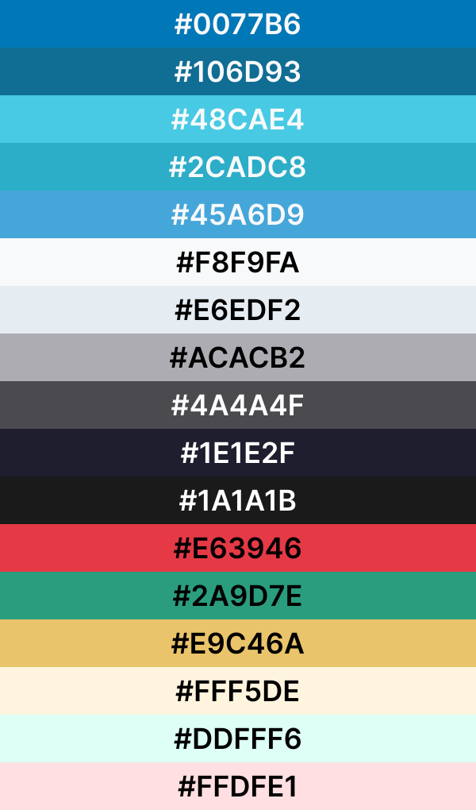

# Template padrão da aplicação

Pré-requisitos: <a href="02-Especificacao.md"> Especificação do projeto</a>, <a href="03-Metodologia.md"> Metodologia</a>, <a href="05-Projeto-interface.md"> Projeto de interface</a>

A aplicação será composta em todas as telas or uma sidebar com as principais ações que o usuário pode executar dentro do sistema. Existem botões CTA para direcionar o tipo de usuário à tarefa principal que ele pode executar no sistema.

<b>Paleta de Cores:</b>

 Tipografias: 

A responsividade será implementada junto à biblioteca Shadcn, que disponibiliza componentes Reacts responsivos.
