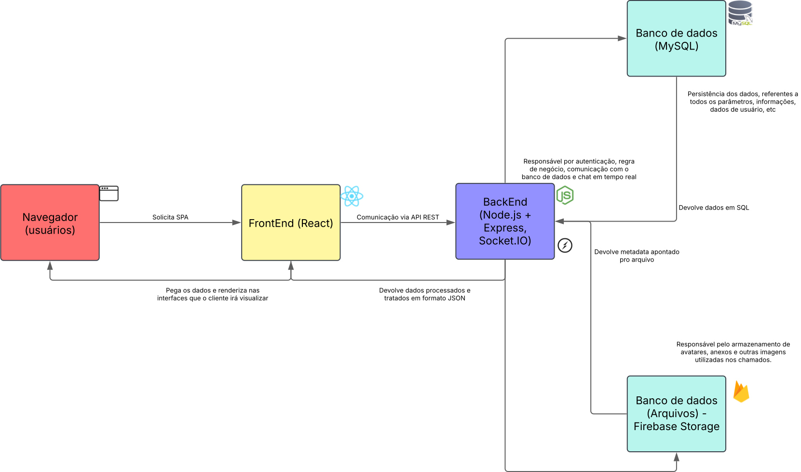

# Arquitetura da solução

<span style="color:red">Pré-requisitos: <a href="05-Projeto-interface.md"> Projeto de interface</a></span>

A solução é composta por três camadas principais:
<ol>

<li><p><b>Frontend (Cliente - Navegador)</b></p>
Desenvolvido com React, TypeScript, Vite e TailwindCSS, o frontend é responsável pela interface gráfica do usuário e comunicação com o backend por meio de HTTP (REST API) e WebSocket (via Socket.IO). Toda a navegação e exibição de dados acontece no navegador do usuário, com sessões autenticadas via JWT armazenadas localmente.

<br><li><p><b>Backend (Servidor)</b></p>
Implementado com Node.js e Express, o backend é a camada responsável pela lógica de negócio, regras de acesso, tratamento das requisições e conexão com o banco de dados e serviços externos. A autenticação é feita por JWT, e o chat em tempo real entre cliente e analista é viabilizado com Socket.IO.

<br><li><p><b>Serviços de Dados</b></p>

 - Banco de Dados Relacional (MySQL): utilizado para armazenar dados estruturados como usuários, chamados, mensagens e parâmetros do sistema.

- Firebase Storage: armazena arquivos binários (imagens, documentos anexados aos chamados), e os registros no banco de dados fazem referência às URLs desses arquivos.
</ol><br>



## Diagrama de classes


1- Gerencia
Atributos:
idGerencia: Identificador do setor de gerência.
cargo: Cargo da pessoa responsável pela gerência.
nomeGerencia: Nome do responsável pela gerência.
Métodos:
modificarUsuario(): Modifica as informações de um usuário.
excluirUsuario(): Exclui um usuário do sistema.

2- Usuário
Atributos:
idUsuario: Identificador único do usuário.
matricula: Número de matrícula do usuário.
nomeUsuario: Nome do usuário.
email: E-mail do usuário.
senhaHash: Senha do usuário, armazenada de forma segura.
dataCadastro: Data de cadastro do usuário.
ativo: Indica se o usuário está ativo.
fotoPerfil: Foto de perfil do usuário.
tipoUsuario: Tipo do usuário, relacionado à classe TipoUsuario.
idGerencia: Relacionamento com o setor de gerência do usuário.
Métodos:
verifLogin(): Verifica as credenciais de login.
registrarChamado(): Registra um novo chamado.
comentarChamado(): Comenta em um chamado.

3- TipoUsuario
Atributos:
idTipoUsuario: Identificador do tipo de usuário.
nome: Nome do tipo de usuário (ex: "Analista", "Solicitante").
temPermissao: Indica se o tipo de usuário tem permissões para realizar determinadas ações.

4- MensagemChamado
Atributos:
idMensagem: Identificador único da mensagem.
mensagem: Texto da mensagem.
timestamp: Data e hora em que a mensagem foi criada.
remetente: Quem enviou a mensagem.
urlAnexo: Link para um anexo, caso haja.
nomeArquivo: Nome do arquivo do anexo.
idChamado: Identificador do chamado ao qual a mensagem está vinculada.
idSolicitante: Identificador de quem solicitou a mensagem.
idAnalista: Identificador do analista que responde ou gerencia a mensagem.
Método: enviarMensagem(): Envia uma mensagem para um chamado.

5- Chamado
Atributos:
idChamado: Identificador único do chamado.
protocolo: Número de protocolo relacionado ao chamado.
assunto: Título ou resumo do chamado.
descricao: Descrição detalhada do problema ou solicitação.
dataAbertura: Data e hora de abertura do chamado.
dataAtualizacao: Data e hora da última atualização.
dataFechamento: Data e hora de fechamento do chamado (se houver).
status: Estado atual do chamado (relacionado à classe StatusChamado).
categoria: Categoria do chamado (relacionada à classe CategoriaChamado).
prioridade: Prioridade do chamado (relacionada à classe prioridadeChamado).
idSolicitante: Identificador de quem criou o chamado.
idAnalista: Identificador do analista responsável.
Métodos:
enviarMensagem(): Envia uma mensagem para o chamado.
atribuirStatus(): Atribui um status ao chamado.
encerrarChamado(): Encerra o chamado após sua resolução.

6- StatusChamado
Atributos:
idStatus: Identificador do status.
nomeStatus: Nome do status (ex: "Aberto", "Fechado").
ativo: Indica se o status está ativo.
Método: alterarStatus(): Altera o status do chamado.

7- CategoriaChamado
Atributos:
idCategoria: Identificador da categoria.
tipoCategoria: Tipo ou nome da categoria (ex: "Problema Técnico").
ativo: Indica se a categoria está ativa.
Método: alterarCategoria(): Altera os dados da categoria.

8- PrioridadeChamado
Atributos:
idPrioridade: Identificador da prioridade.
tipoPrior: Tipo de prioridade (ex: "Alta", "Média").
descricaoPrior: Descrição detalhada da prioridade.
ativo: Indica se a prioridade está ativa.
Método: alterarPrioridade(): Altera a prioridade do chamado.

9- Notificação
Atributos:
idNotificacao: Identificador único da notificação.
habilitada: Indica se a notificação está habilitada ou não.
idChamado: Relacionamento com o chamado a que a notificação se refere.
idUsuário: Identificador do usuário para quem a notificação é direcionada.
Método: enviarNotif(): Envia uma notificação para um usuário sobre um chamado.

Relacionamentos:
Chamado - MensagemChamado: Um chamado pode ter várias mensagens, e cada mensagem pertence a um chamado específico (relacionamento de 1 para N).
Chamado - StatusChamado: Cada chamado tem um status que pode ser alterado ao longo do tempo (relacionamento de 1 para 1).
Chamado - CategoriaChamado: Cada chamado pertence a uma categoria específica (relacionamento de 1 para 1).
Chamado - PrioridadeChamado: Cada chamado tem uma prioridade associada (relacionamento de 1 para 1).
Chamado - Notificação: As notificações são associadas aos chamados e informam os usuários sobre atualizações (relacionamento de 1 para N).
Gerencia - Usuário: Um usuário pode ser associado a uma gerência (relacionamento de 1 para N).
Usuário - TipoUsuario: Cada usuário tem um tipo específico, como "Solicitante", "Analista", etc. (relacionamento de 1 para 1).
O modelo é voltado para um sistema de suporte, onde os usuários registram chamados, os analistas gerenciam e atualizam esses chamados, e o sistema envia notificações relacionadas a esses chamados.


##  Modelo de dados

O desenvolvimento da solução proposta requer a existência de bases de dados que permitam realizar o cadastro de dados e os controles associados aos processos identificados, assim como suas recuperações.

Utilizando a notação do DER (Diagrama Entidade-Relacionamento), elabore um modelo, usando alguma ferramenta, que contemple todas as entidades e atributos associados às atividades dos processos identificados. Deve ser gerado um único DER que suporte todos os processos escolhidos, visando, assim, uma base de dados integrada. O modelo deve contemplar também o controle de acesso dos usuários (partes interessadas nos processos) de acordo com os papéis definidos nos modelos do processo de negócio.

Apresente o modelo de dados por meio de um modelo relacional que contemple todos os conceitos e atributos apresentados na modelagem dos processos.

### Modelo ER

Este modelo de banco de dados simplificado visa estruturar as informações essenciais para um sistema de abertura de chamados, focando nas entidades principais e seus relacionamentos. Cada tabela possui uma chave primária (PK) para identificar seus registros de forma única e chaves estrangeiras (FK) utilizadas para estabelecer os relacionamentos entre as tabelas, garantindo a integridade referencial. O Modelo ER abaixo representa, como as entidades (coisas, objetos) se relacionam entre si na aplicação interativa.


### Esquema Relacional

O modelo de banco de dados a seguir foi projetado para que permita a interação entre usuários e analistas, o rastreamento de problemas e a gestão do ciclo de vida dos chamados. Cada tabela possui uma chave primária única para identificar seus registros além de possuir chaves estrangeiras que são utilizadas para estabelecer e reforçar os relacionamentos entre as tabelas, garantindo a integridade referencial dos dados buscando representar de forma clara e estruturada as entidades e seus relacionamentos no sistema de abertura de chamados, fornecendo uma base sólida para a criação do banco de dados físico. O Esquema Relacional abaixo corresponde à representação dos dados em tabelas juntamente com as restrições de integridade e chave primária. 
 


---

### Modelo físico

```sql
-- MySQL Workbench Forward Engineering

SET @OLD_UNIQUE_CHECKS=@@UNIQUE_CHECKS, UNIQUE_CHECKS=0;
SET @OLD_FOREIGN_KEY_CHECKS=@@FOREIGN_KEY_CHECKS, FOREIGN_KEY_CHECKS=0;
SET @OLD_SQL_MODE=@@SQL_MODE, SQL_MODE='ONLY_FULL_GROUP_BY,STRICT_TRANS_TABLES,NO_ZERO_IN_DATE,NO_ZERO_DATE,ERROR_FOR_DIVISION_BY_ZERO,NO_ENGINE_SUBSTITUTION';

-- -----------------------------------------------------
-- Schema db_trackit
-- -----------------------------------------------------

-- -----------------------------------------------------
-- Schema db_trackit
-- -----------------------------------------------------
CREATE SCHEMA IF NOT EXISTS `db_trackit` DEFAULT CHARACTER SET utf8 ;
USE `db_trackit` ;

-- -----------------------------------------------------
-- Table `db_trackit`.`tipoUsuario`
-- -----------------------------------------------------
CREATE TABLE IF NOT EXISTS `db_trackit`.`tipoUsuario` (
  `idTipoUsuario` INT(2) NOT NULL,
  `tipoUsuario` VARCHAR(10) NOT NULL,
  PRIMARY KEY (`idTipoUsuario`))
ENGINE = InnoDB;


-- -----------------------------------------------------
-- Table `db_trackit`.`Usuario`
-- -----------------------------------------------------
CREATE TABLE IF NOT EXISTS `db_trackit`.`Usuario` (
  `idUsuario` INT NOT NULL AUTO_INCREMENT,
  `nivelUsuario` INT NOT NULL,
  `nomeUsuario` VARCHAR(50) NOT NULL,
  `email` VARCHAR(75) NOT NULL,
  `senhaHash` VARCHAR(20) NOT NULL,
  `dataCadastro` DATE NOT NULL,
  `ativo` TINYINT NOT NULL,
  PRIMARY KEY (`idUsuario`),
  UNIQUE INDEX `email_UNIQUE` (`email` ASC) VISIBLE,
  INDEX `fk_Usuario_tipoUsuario1_idx` (`nivelUsuario` ASC) VISIBLE,
  CONSTRAINT `fk_Usuario_tipoUsuario1`
    FOREIGN KEY (`nivelUsuario`)
    REFERENCES `db_trackit`.`tipoUsuario` (`idTipoUsuario`)
    ON DELETE NO ACTION
    ON UPDATE NO ACTION)
ENGINE = InnoDB;


-- -----------------------------------------------------
-- Table `db_trackit`.`statusChamado`
-- -----------------------------------------------------
CREATE TABLE IF NOT EXISTS `db_trackit`.`statusChamado` (
  `idStatus` INT NOT NULL AUTO_INCREMENT,
  `nomeStatus` VARCHAR(15) NOT NULL,
  PRIMARY KEY (`idStatus`))
ENGINE = InnoDB;


-- -----------------------------------------------------
-- Table `db_trackit`.`categoriaChamado`
-- -----------------------------------------------------
CREATE TABLE IF NOT EXISTS `db_trackit`.`categoriaChamado` (
  `idCategoria` INT NOT NULL,
  `tipoCategoria` VARCHAR(15) NOT NULL,
  PRIMARY KEY (`idCategoria`))
ENGINE = InnoDB;


-- -----------------------------------------------------
-- Table `db_trackit`.`prioridadeChamado`
-- -----------------------------------------------------
CREATE TABLE IF NOT EXISTS `db_trackit`.`prioridadeChamado` (
  `idPriorChamado` INT NOT NULL,
  `tipoPrior` VARCHAR(45) NOT NULL,
  PRIMARY KEY (`idPriorChamado`))
ENGINE = InnoDB;


-- -----------------------------------------------------
-- Table `db_trackit`.`chamado`
-- -----------------------------------------------------
CREATE TABLE IF NOT EXISTS `db_trackit`.`chamado` (
  `idChamado` INT(6) NOT NULL AUTO_INCREMENT,
  `protocolo` VARCHAR(45) NOT NULL,
  `titulo` LONGTEXT NOT NULL,
  `dataAbertura` DATETIME NOT NULL,
  `dataAtualizacao` DATETIME NULL,
  `dataFechamento` DATETIME NULL,
  `idUsuaAbriu` INT NOT NULL,
  `idResponsavel` INT NOT NULL,
  `statusAtual` INT NOT NULL,
  `categoria` INT NOT NULL,
  `prioridade` INT NOT NULL,
  PRIMARY KEY (`idChamado`),
  UNIQUE INDEX `protocolo_UNIQUE` (`protocolo` ASC) VISIBLE,
  INDEX `fk_chamado_Usuario1_idx` (`idUsuaAbriu` ASC) VISIBLE,
  INDEX `fk_chamado_Usuario2_idx` (`idResponsavel` ASC) VISIBLE,
  INDEX `fk_chamado_statusChamado1_idx` (`statusAtual` ASC) VISIBLE,
  INDEX `fk_chamado_categoriaChamado1_idx` (`categoria` ASC) VISIBLE,
  INDEX `fk_chamado_prioridadeChamado1_idx` (`prioridade` ASC) VISIBLE,
  CONSTRAINT `fk_chamado_Usuario1`
    FOREIGN KEY (`idUsuaAbriu`)
    REFERENCES `db_trackit`.`Usuario` (`idUsuario`)
    ON DELETE NO ACTION
    ON UPDATE NO ACTION,
  CONSTRAINT `fk_chamado_Usuario2`
    FOREIGN KEY (`idResponsavel`)
    REFERENCES `db_trackit`.`Usuario` (`idUsuario`)
    ON DELETE NO ACTION
    ON UPDATE NO ACTION,
  CONSTRAINT `fk_chamado_statusChamado1`
    FOREIGN KEY (`statusAtual`)
    REFERENCES `db_trackit`.`statusChamado` (`idStatus`)
    ON DELETE NO ACTION
    ON UPDATE NO ACTION,
  CONSTRAINT `fk_chamado_categoriaChamado1`
    FOREIGN KEY (`categoria`)
    REFERENCES `db_trackit`.`categoriaChamado` (`idCategoria`)
    ON DELETE NO ACTION
    ON UPDATE NO ACTION,
  CONSTRAINT `fk_chamado_prioridadeChamado1`
    FOREIGN KEY (`prioridade`)
    REFERENCES `db_trackit`.`prioridadeChamado` (`idPriorChamado`)
    ON DELETE NO ACTION
    ON UPDATE NO ACTION)
ENGINE = InnoDB;


-- -----------------------------------------------------
-- Table `db_trackit`.`msgChamado`
-- -----------------------------------------------------
CREATE TABLE IF NOT EXISTS `db_trackit`.`msgChamado` (
  `idMsg` INT NOT NULL AUTO_INCREMENT,
  `idChamado` INT NOT NULL,
  `idUsuario` INT NOT NULL,
  `idAnalista` INT NOT NULL,
  `mensagem` TEXT NOT NULL,
  `timestamp` DATETIME NULL DEFAULT CURRENT_TIMESTAMP,
  `remetente` ENUM('usuario', 'analista') NOT NULL,
  PRIMARY KEY (`idMsg`),
  INDEX `fk_msgChamado_chamado1_idx` (`idChamado` ASC) VISIBLE,
  INDEX `fk_msgChamado_chamado2_idx` (`idUsuario` ASC) VISIBLE,
  INDEX `fk_msgChamado_chamado3_idx` (`idAnalista` ASC) VISIBLE,
  CONSTRAINT `fk_msgChamado_chamado1`
    FOREIGN KEY (`idChamado`)
    REFERENCES `db_trackit`.`chamado` (`idChamado`)
    ON DELETE NO ACTION
    ON UPDATE NO ACTION,
  CONSTRAINT `fk_msgChamado_chamado2`
    FOREIGN KEY (`idUsuario`)
    REFERENCES `db_trackit`.`chamado` (`idUsuaAbriu`)
    ON DELETE NO ACTION
    ON UPDATE NO ACTION,
  CONSTRAINT `fk_msgChamado_chamado3`
    FOREIGN KEY (`idAnalista`)
    REFERENCES `db_trackit`.`chamado` (`idResponsavel`)
    ON DELETE NO ACTION
    ON UPDATE NO ACTION)
ENGINE = InnoDB;


SET SQL_MODE=@OLD_SQL_MODE;
SET FOREIGN_KEY_CHECKS=@OLD_FOREIGN_KEY_CHECKS;
SET UNIQUE_CHECKS=@OLD_UNIQUE_CHECKS;
```
Esse script deverá ser incluído em um arquivo .sql na pasta [de scripts SQL](../src/db).


## Tecnologias


Apresente também uma figura explicando como as tecnologias estão relacionadas ou como uma interação do usuário com o sistema vai ser conduzida, por onde ela passa até retornar uma resposta ao usuário.


| Camada             | Tecnologia / Ferramenta                 | Propósito                             |
| ------------------ | --------------------------------------- | ------------------------------------- |
| **Frontend**       | React                                   | UI reativa                            |
|                    | TypeScript                              | Tipagem estática                      |
|                    | Vite                                    | Bundler rápido                        |
|                    | Tailwind CSS                            | Utility‑first CSS                     |
|                    | shadcn/ui                               | Component library baseada em Tailwind |
|                    | React Router                            | Navegação                             |
|                    | React Query (TanStack Query)            | Fetch/cache de dados                  |
|                    | React Hook Form + Zod                   | Gestão e validação de formulários     |
|                    | Sonner (ou React‑Toastify)              | Toast notifications                   |
|                    | Socket.io‑client                        | Chat em tempo real                    |
|                    | eslint + Prettier + Husky + lint‑staged | Linter, formatting e git hooks        |
|                    | Vitest                                  | Testes unitários e de componentes     |
| **Backend**        | Node.js                                 | Runtime                               |
|                    | TypeScript                              | Tipagem                               |
|                    | Express.js                              | Framework HTTP                        |
|                    | Prisma ORM                              | Modelagem e accesso ao MySQL          |
|                    | jsonwebtoken                            | JWT auth                              |
|                    | bcrypt                                  | Hash de senhas                        |
|                    | Socket.io                               | Chat em tempo real                    |
|                    | Nodemailer                              | Envio de e‑mail                       |
|                    | Zod                                     | Validação de payloads                 |
|                    | dotenv                                  | Variáveis de ambiente                 |
|                    | winston ou pino                         | Logging                               |
|                    | Jest + Supertest                        | Testes de unidade e integração        |
|                    | ESLint + Prettier + Husky               | Linter, formatting e git hooks        |
| **Banco de Dados** | MySQL (PlanetScale)                     | Dados relacionais                     |
|                    | Prisma Migrate                          | Migrations                            |
| **Armazenamento**  | Firebase Storage                        | Arquivos e imagens                    |
| **CI/CD & Infra**  | GitHub Actions                          | Pipeline de build/test/deploy         |
|                    | Vercel (frontend)                       | Deploy frontend                       |
|                    | Railway (backend)                       | Deploy backend                        |
|                    | PlanetScale                             | Banco MySQL serverless                |


## Hospedagem

Serão utilzados o Vercel e o Railway para hospedagem do frontend e backend respectivamente, além disso o banco de dados será hospedado pelo PlanetScale. Detalhes maiores da implementação serão apresentados posteriormente.

## Qualidade de software

### Functional Suitability
| Subcaracterística          | Justificativa                                                                                                              | Métrica (objetivo)                                                       |
| -------------------------- | -------------------------------------------------------------------------------------------------------------------------- | ------------------------------------------------------------------------ |
| Functional completeness    | Garantir que todas as funcionalidades-chave (cadastro, abertura de chamado, chat, dashboards) estejam implementadas.       | % de requisitos funcionais implementados (meta ≥ 100 %)                  |
| Functional correctness     | As respostas do sistema (API) devem estar alinhadas ao esperado pelos casos de uso (por ex. geração de protocolo correto). | Nº de incidentes em produção por comportamento inesperado (meta ≤ 2/mês) |
| Functional appropriateness | A interface e os fluxos devem permitir que o usuário complete tarefas com mínimo de esforço.                               | Tempo médio para abrir um chamado (meta ≤ 30 s)                          |

### Performance Efficiency

| Subcaracterística    | Justificativa                                                               | Métrica (objetivo)                         |
| -------------------- | --------------------------------------------------------------------------- | ------------------------------------------ |
| Time behavior        | O sistema deve responder rapidamente às interações (forms, listagem, chat). | 95 % das requisições < 2 s                 |
| Resource utilization | Uso moderado de CPU/memória no servidor para suportar escalabilidade.       | CPU < 70 % sob carga média; memória < 75 % |

### Usability

| Subcaracterística     | Justificativa                                                                   | Métrica (objetivo)                               |
| --------------------- | ------------------------------------------------------------------------------- | ------------------------------------------------ |
| Operability           | Facilitar a curva de aprendizado e eficiência no uso (labels claras, feedback). | SUS (System Usability Scale) ≥ 80                |
| Learnability          | Novos usuários devem conseguir abrir seu primeiro chamado sem ajuda externa.    | Tempo até 1º chamado ≤ 2 min (80 % dos usuários) |
| User error protection | Minimizam-se erros de input (validações em formulário, confirmação de ações).   | Nº de erros de formulário por sessão ≤ 1         |

### Security

| Subcaracterística | Justificativa                                                             | Métrica (objetivo)                   |
| ----------------- | ------------------------------------------------------------------------- | ------------------------------------ |
| Confidentiality   | Dados sensíveis (senhas, e‑mails) devem permanecer protegidos.            | 100 % das senhas armazenadas em hash |
| Authenticity      | Garantir que apenas usuários autenticados acessem suas áreas autorizadas. | 0 acessos não autorizados detectados |

### Maintainability

| Subcaracterística | Justificativa                                                          | Métrica (objetivo)                   |
| ----------------- | ---------------------------------------------------------------------- | ------------------------------------ |
| Modularity        | Código organizado em módulos (features) facilita evolução e debugging. | Cobertura de módulos testados ≥ 90 % |
| Testability       | Facilidade para escrever e executar testes automatizados.              | Coverage (unit+integration) ≥ 80 %   |
| Analysability     | Facilidade de localizar causa de defeitos em logs e monitoramento.     | MTTR (Mean Time to Repair) ≤ 4 h     |
