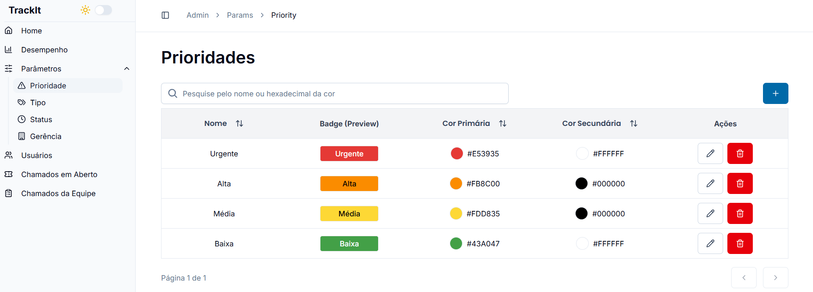
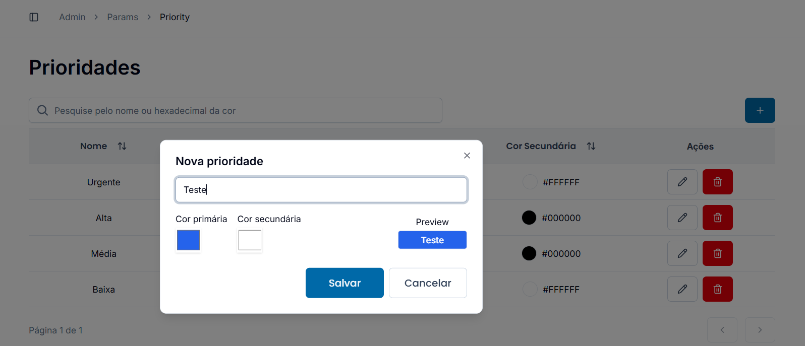
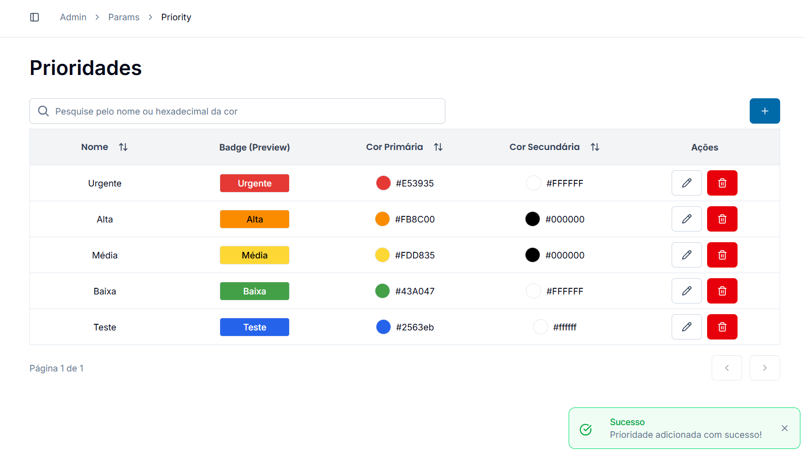
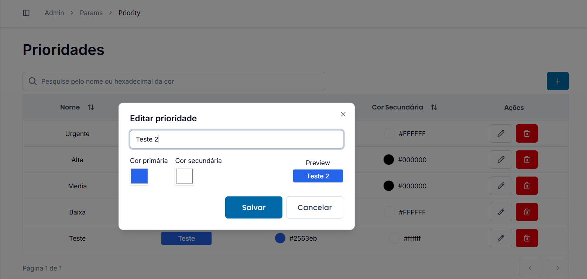
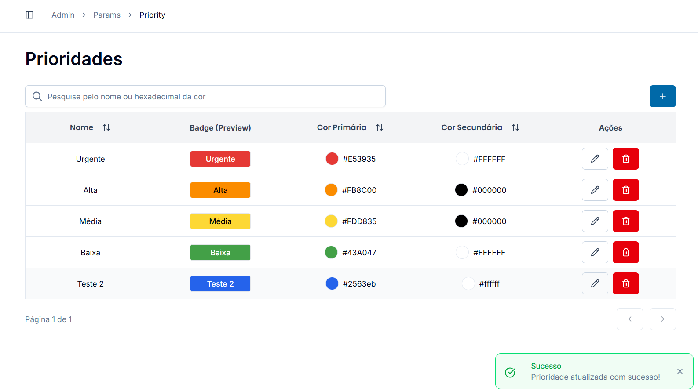
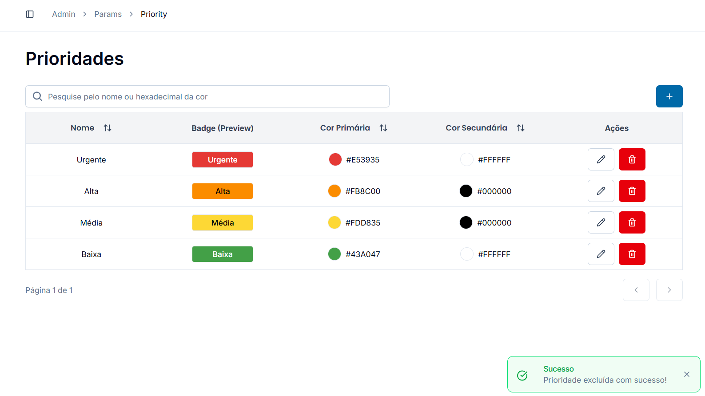
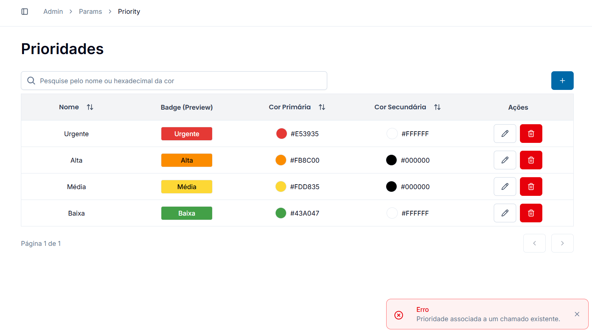

# Registro de testes de software

Pré-requisitos: <a href="05-Projeto-interface.md"> Projeto de interface</a>, <a href="08-Plano-testes-software.md"> Plano de testes de software</a>

Relatório com as evidências dos testes de software realizados no sistema pela equipe, baseado no plano de testes pré-definido.

| **Caso de teste** 	| **CT-009 – Gerenciar parâmetros** 	|
|:---:	|:---:	|
| Requisito associado | RF-009 - aplicação deve permitir que os usuários que possuem perfil de gestor possam visualizar, criar, editar e deletar (se aplicável), as gerências, prioridades, status e tipos de demandas do TrackIT|
| Registro de evidência |                     | 

**Explicação RF-009**: O usuário com perfil de gestor pode visualizar, criar, editar e deletar todos os parâmetros do sistema desde que não estejam associado à um chamado e/ou usuário. Isso garante um bom controle ao gestor, que consegue definir o que a equipe dele vai atender e vindo de quem. Existem validações no sistema, quantidade mínima e máxima de caracteres, restrição de integridade de FK, não permite enviar formulário vazio, dentre outras. As mesmas funcionalidades da prioridade de demanda (representado nas evidências) valem para tipo de demanda, gerência e status de demanda, com as mesmas regras também.

 

| **Caso de teste** 	| **CT-002 – Realizar login** 	|
|:---:	|:---:	|
| Requisito associado | RF-00Y - A aplicação deve permitir que um usuário previamente cadastrado faça login. |
| Registro de evidência | [www.teste.com.br/drive/ct-02](http://www.teste.com.br/drive/ct-02) |

> **Links úteis**:
> - [Screencast: entenda o que é e como gravar vídeos com ele](https://rockcontent.com/br/blog/screencast/) 

## Avaliação

Discorra sobre os resultados do teste, ressaltando os pontos fortes e fracos identificados na solução. Comente como o grupo pretende abordar esses pontos nas próximas iterações. Apresente as falhas detectadas e as melhorias geradas a partir dos resultados obtidos nos testes.

> **Links úteis**:
> - [Ferramentas de Teste para JavaScript](https://geekflare.com/javascript-unit-testing/)
