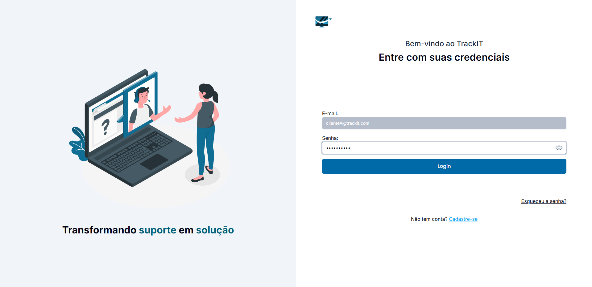

# Registro de testes de software

Pré-requisitos: <a href="05-Projeto-interface.md"> Projeto de interface</a>, <a href="08-Plano-testes-software.md"> Plano de testes de software</a>

Relatório com as evidências dos testes de software realizados no sistema pela equipe, baseado no plano de testes pré-definido.

| **Caso de teste** 	| **CT-001 – Efetuar cadastro** 	|
|:---:	|:---:	|
| Requisito associado | RF-001 - A aplicação deve possuir opção de fazer cadastro, sendo necessário preencher campos: Nome completo, Matrícula, Ramal, Gerência, Email, Senha e Confirmar a senha |
| Registro de evidência |         |

**Explicação RF-001**: O sistema exige que o usuário preencha corretamente todos os campos obrigatórios para cadastro, como nome completo, matrícula, ramal, gerência, e-mail, senha e confirmação de senha. Existem validações de formato de e-mail, confirmação de senha, tamanho mínimo e máximo de caracteres e obrigatoriedade dos campos. O cadastro só é realizado se todas as validações forem atendidas, garantindo a integridade dos dados dos usuários.

 

| **Caso de teste** 	| **CT-002 – Efetuar login** 	|
|:---:	|:---:	|
| Requisito associado | RF-001 - A aplicação deve possuir opção de fazer login, sendo necessário preencher os campos: Email e Senha. |
| Registro de evidência |       |

**Explicação RF-002**: O login exige que o usuário informe um e-mail e senha válidos previamente cadastrados. O sistema valida o formato do e-mail e a presença dos campos. Caso os dados estejam corretos, o usuário é autenticado e redirecionado para a área principal do sistema. Em caso de erro, mensagens de validação são exibidas, protegendo o acesso não autorizado.

 

| **Caso de teste** 	| **CT-003 – Recuperar a senha** 	|
|:---:	|:---:	|
| Requisito associado | RF-002 - A aplicação deve permitir que o usuário recupere sua senha informando o e-mail cadastrado. |
| Registro de evidência |               |

**Explicação RF-003**: O processo de recuperação de senha permite que o usuário informe seu e-mail cadastrado para receber um link de redefinição. O sistema valida o e-mail, envia uma mensagem de sucesso e um link para redefinir a senha. O usuário deve acessar o e-mail, clicar no link, definir uma nova senha e será redirecionado para a tela de login. Existem validações para garantir que apenas usuários cadastrados possam redefinir a senha e que a nova senha atenda aos critérios de segurança.

 

| **Caso de teste** 	| **CT-004 – Abrir chamado** 	|
|:---:	|:---:	|
| Requisito associado | RF-003 - A aplicação deve permitir que o usuário, após logado, abra um chamado preenchendo os campos: Assunto da demanda, Prioridade da demanda, Tipo da demanda, Descrição da demanda e, opcionalmente, anexar arquivo. |
| Registro de evidência |            |

**Explicação RF-004**: Para abrir um chamado, o usuário precisa estar autenticado e preencher todos os campos obrigatórios: assunto da demanda, prioridade, tipo e descrição. O sistema valida a presença e o formato dos dados, além de permitir anexar arquivos opcionalmente. Após o envio, se os dados forem válidos, o chamado é criado e o usuário é redirecionado para a tela de "Meus chamados". Isso garante que apenas chamados completos e válidos sejam registrados.

 

| **Caso de teste** 	| **CT-005 – Visualizar meus chamados** 	|
|:---:	|:---:	|
| Requisito associado | RF-004 - A aplicação deve permitir que o usuário visualize seus chamados, incluindo: número do protocolo, assunto, data de abertura, prioridade, status, analista responsável (se atribuído) e acesso ao chat ao vivo. |
| Registro de evidência |      |

**Explicação RF-005**: A tela "Meus chamados" exibe todos os chamados abertos pelo usuário, mostrando informações como número do protocolo, assunto, data de abertura, prioridade, status e analista responsável (caso atribuído). O usuário pode acessar detalhes do chamado e iniciar um chat ao vivo com o analista ou gestor responsável. O sistema garante que apenas os chamados do usuário logado sejam exibidos, protegendo a privacidade e facilitando o acompanhamento das demandas.

 

| **Caso de teste** 	| **CT-006 – Chat do chamado** 	|
|:---:	|:---:	|
| Requisito associado | RF-005 - A aplicação deve permitir que o usuário utilize o chat do chamado para enviar mensagens e anexos, visualizar a descrição original do chamado e receber mensagens/arquivos de analistas e/ou gestores. |
| Registro de evidência |         |

**Explicação RF-006**: O chat do chamado permite que o usuário troque mensagens e arquivos com analistas e/ou gestores responsáveis pelo atendimento. O usuário pode visualizar a descrição original do chamado, enviar mensagens e anexos, e receber respostas em tempo real. O sistema valida os formatos dos arquivos anexados e garante que todas as mensagens e arquivos fiquem registradas no histórico do chamado, promovendo comunicação eficiente e rastreabilidade.

 

| **Caso de teste** 	| **CT-007 – Analista - Visualizar e Filtrar Chamados** 	|
|:---:	|:---:	|
| Requisito associado | RF-006 - O analista deve visualizar todos os chamados em aberto e filtrá-los conforme necessidade. |
| Registro de evidência |         |

**Explicação RF-007**: O analista consegue organizar a lista de chamados da forma que mais vai atender a necessidade dele, seja os chamados com prioridade mais urgente, por chamado que foi aberto a mais tempo, número de protocolo. Isso facilita para que ele consiga ter uma melhor gestão de tempo e prioridades nos seus atendimentos.

 

| **Caso de teste** 	| **CT-008 – Analista - Atribuir um Chamado para Si** 	|
|:---:	|:---:	|
| Requisito associado | RF-007 - O analista deve poder atribuir um chamado a si mesmo, movendo-o para sua fila de atendimento. |
| Registro de evidência |          |

**Explicação RF-008**: O analista consegue ver todos os chamados que estão pendentes necessitando de atendimento, ele pode escolher qual ou quais chamados vai atender sem precisar necessariamente agurdar o seu gestor atribuir os chamados abertos para os analistas.

 

| **Caso de teste** 	| **CT-009 – Analista - Responder e Alterar Status de um Chamado** 	|
|:---:	|:---:	|
| Requisito associado | RF-008 - O analista deve poder enviar mensagens no chamado e alterar o status da demanda, mantendo o fluxo do atendimento. |
| Registro de evidência |              |

**Explicação RF-009**: O analista consegue trocar mensagens com o usuário para que facilite o atendimento da demanda além de alterar o status do chamado durante o decorrer do atendimento para melhor controle da demanda além de ser um feedback para o usuário de como está o andamento do chamado.

 

| **Caso de teste** 	| **CT-010 – Analista - Fechar e Reabrir um Chamado** 	|
|:---:	|:---:	|
| Requisito associado | RF-009 - A aplicação deve permitir que o analista finalize ou reabra um chamado. |
| Registro de evidência |           |

**Explicação RF-010**: O analista consegue fechar um chamado quando entender que a demanda foi concluída ou então reabrir um chamado caso necessário.

 

| **Caso de teste** 	| **CT-011 – Analista - Visualizar Dashboard** 	|
|:---:	|:---:	|
| Requisito associado | RF-010 - O analista deve conseguir ver dados sobre seu desempenho, através de gráfico e números de chamados atendidos. |
| Registro de evidência |           |

**Explicação RF-010**: O analista consegue visualizar o seu desempenho através da quantidade de chamados atendidos disponibilizado através de relatórios e gráficos disponíveis no dashboard.

 

| **Caso de teste** 	| **CT-012 – Gerenciar parâmetros** 	|
|:---:	|:---:	|
| Requisito associado | RF-012 - aplicação deve permitir que os usuários que possuem perfil de gestor possam visualizar, criar, editar e deletar (se aplicável), as gerências, prioridades, status e tipos de demandas do TrackIT|
| Registro de evidência |                     | 

**Explicação RF-009**: O usuário com perfil de gestor pode visualizar, criar, editar e deletar todos os parâmetros do sistema desde que não estejam associado à um chamado e/ou usuário. Isso garante um bom controle ao gestor, que consegue definir o que a equipe dele vai atender e vindo de quem. Existem validações no sistema, quantidade mínima e máxima de caracteres, restrição de integridade de FK, não permite enviar formulário vazio, dentre outras. As mesmas funcionalidades da prioridade de demanda (representado nas evidências) valem para tipo de demanda, gerência e status de demanda, com as mesmas regras também.

 

> **Links úteis**:
> - [Screencast: entenda o que é e como gravar vídeos com ele](https://rockcontent.com/br/blog/screencast/) 

## Avaliação

Discorra sobre os resultados do teste, ressaltando os pontos fortes e fracos identificados na solução. Comente como o grupo pretende abordar esses pontos nas próximas iterações. Apresente as falhas detectadas e as melhorias geradas a partir dos resultados obtidos nos testes.

> **Links úteis**:
> - [Ferramentas de Teste para JavaScript](https://geekflare.com/javascript-unit-testing/)
