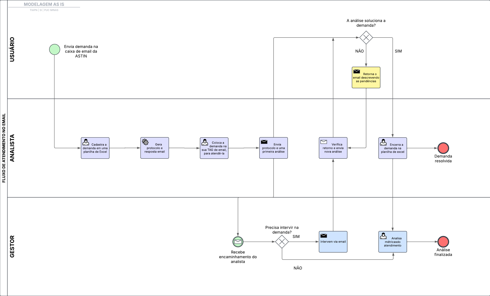

## 3.3.1 Processo 1 – FLUXO DE ATENDIMENTO DE DEMANDAS

_O diagrama abaixo descreve o fluxo atual desses atendimentos. Ao decorrer da análise, iremos expor como um sistema automatizado que integra todas as funcionalidades em um único local poderia melhorar a eficiência dos processos._
 

### Detalhamento das atividades no modelo AS IS

Atualmente, o processo de atendimento a demandas ocorre de forma manual, onde utiliza-se um e-mail institucional próprio pelo qual chegam as demandas dos usuários e uma planilha de Excel (chamada internamente de _PDU_) para registrar e acompanhar as solicitações. Essa abordagem resulta em ineficiências, retrabalho e dificuldades no monitoramento das demandas.

O fluxo envolve três atores principais:

- **Usuário (Solicitante)**: Envia a solicitação para o email da ASTIN.

- **Analista de Atendimento**: Recebe, registra e analisa a solicitação.

- **Gestor**: Supervisiona o andamento das solicitações e intervém quando necessário.

### Fluxo do Processo

**Envio da solicitação**

O usuário envia um e-mail para a caixa de entrada da ASTIN. Não há padronização nessas solicitações: algumas chegam sem assunto, outras são mal explicadas e, em certos casos, o e-mail é enviado por engano, pois o usuário não sabe exatamente qual setor é responsável pelo atendimento ou processo solicitado.

**Visualização da solicitação e cadastro no PDU**

O analista identifica a chegada de uma nova solicitação na caixa de entrada e, em seguida, abre a planilha do Excel (_PDU_) para cadastrar a demanda. Os principais campos utilizados nesse registro são: nome do solicitante, tipo da demanda, prioridade e data da solicitação. Como as informações fornecidas pelo usuário não seguem um padrão, o preenchimento pode conter inconsistências.

**Geração de protocolo e resposta por e-mail**

Após preencher os campos da planilha, é gerado automaticamente um número de protocolo sequencial para controle interno das demandas. Com base nas informações registradas, o analista utiliza uma resposta pronta, que varia conforme o tipo da solicitação. Por exemplo, se a demanda estiver relacionada ao problema X, há uma resposta específica; se for sobre Y, aplica-se outra.

**Organização por tag de e-mail**

Para organizar o atendimento, o analista utiliza tags no e-mail, movendo a solicitação para a sua tag específica após o cadastro no _PDU_. Essas tags geralmente levam o nome do analista. Em alguns casos, são criadas subtags como "aguardando retorno" ou "resolvido" para controle interno da equipe de atendimento, embora não exista um padrão formal para isso.

**Envio do protocolo e primeira análise**

Após organizar a demanda com a tag, o analista responde ao solicitante com a mensagem pronta contendo o número do protocolo, seguida de uma primeira análise sobre a solicitação.

**Loop do atendimento**

Forma-se então um ciclo de atendimento: o usuário avalia se a primeira análise resolve sua demanda. Caso não resolva, ele responde ao e-mail com mais detalhes ou correções. O analista, por sua vez, realiza novas análises, que são reenviadas ao usuário, até que a demanda seja finalmente solucionada.

**Participação do gestor**

Em determinados casos, é necessária a intervenção do gestor, seja para articular entre áreas ou tratar questões mais sensíveis relacionadas às regras de negócio. Nesses momentos, o gestor intervém diretamente na demanda através do email, apontando suas considerações e orientações.

**Demanda solucionada**

Quando a resposta do analista (e, se houver, a intervenção do gestor) resolve a demanda do usuário, o atendimento é encerrado. Isso é feito por meio da alteração do status da solicitação no _PDU_, de "em aberto/aguardando análise" para "resolvido". Paralelamente, o gestor consegue visualizar métricas dos atendimentos por meio de um gráfico simples presente na planilha. Esse gráfico exibe a quantidade de demandas iniciadas e concluídas por cada analista, além dos tipos de demandas mais frequentes, servindo como um recurso básico para análise de desempenho.

### Identificação de Gargalos no Processo Atual (AS-IS)

**1. Falta de padronização nas solicitações dos usuários**

- Os e-mails chegam sem padrão de formato, assunto ou conteúdo, o que dificulta a triagem e o entendimento da demanda.
- Isso gera retrabalho para o analista, que precisa interpretar informações mal explicadas ou incompletas.

**2. Registro manual e suscetível a erros no PDU (planilha Excel)**

- O preenchimento da planilha é feito manualmente, com base em informações não padronizadas.
- Isso pode gerar inconsistências nos dados, dificultando o controle e rastreabilidade das demandas.
- Além disso, a planilha não oferece recursos avançados de validação ou automação.

**3. Respostas automáticas baseadas em preenchimento manual**

- As mensagens de resposta são dependentes da forma como os campos da planilha são preenchidos.
- Caso o analista preencha incorretamente ou de forma incompleta, a resposta automática pode ser inadequada ou até gerar mal-entendidos com o solicitante.

**4. Organização informal via tags de e-mail**

- O uso de tags para controle de demandas por e-mail é individual e sem padronização.
- Isso dificulta a colaboração entre analistas e a rastreabilidade por parte de gestores.
- Subtags criadas livremente como "aguardando retorno" ou "resolvido" não garantem visibilidade uniforme para a equipe.

**5. Processo de atendimento com muitos ciclos (loop de atendimento)**

- A ausência de formulários padronizados ou ferramentas de suporte ao analista leva a múltiplas trocas de e-mail para solucionar a demanda.
- Esse "loop" de ida e volta pode atrasar significativamente a resolução das demandas.
- A falta de histórico estruturado das interações dificulta o entendimento do progresso da solicitação. Muitos usuários respodem um retorno do analista encaminhando um novo email, tornando a rastreabilidade a demanda totalmente dificultada. Além disso, muitos também não utilizam a opção "Responder pra todos" quando há vários envolvidos no email, com isso, as áreas incluídas não visualizam o retorno, o que atrasa ainda mais o processo.

**6. Intervenção do gestor de forma não sistematizada**

- A participação do gestor ocorre de forma reativa, quando o analista percebe a necessidade.
- Não há um fluxo definido para escalonamento ou registro claro da intervenção, o que pode levar à perda de informações importantes e atrasos.

**7. Encerramento da demanda e acompanhamento pouco eficiente**

- O fechamento do atendimento é feito de forma manual, com alteração de status na planilha.
- O acompanhamento por parte da gestão é baseado em gráficos simples, limitando a análise detalhada de produtividade e tipos de demandas recorrentes.

### Consequências dos Gargalos Identificados

- **Atraso na resolução das demandas**
- **Retrabalho para analistas e usuários**
- **Baixa visibilidade e controle por parte da gestão**
- **Dificuldade na mensuração de desempenho**
- **Falta de escalabilidade do processo**