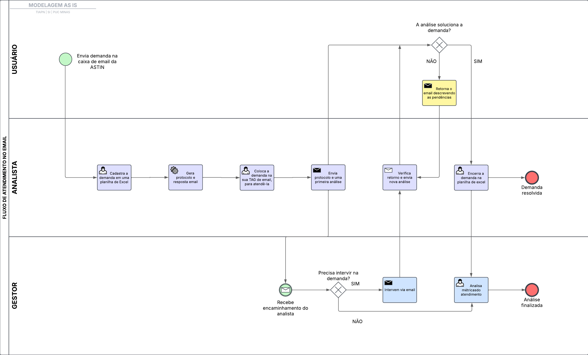

## 3.3.1 Processo 1 – FLUXO DE ATENDIMENTO DE DEMANDAS

_O diagrama abaixo descreve o fluxo atual desses atendimentos. Ao decorrer da análise, iremos expor como um sistema automatizado que integra todas as funcionalidades em um único local poderia melhorar a eficiência dos processos._
 

### Detalhamento das atividades no modelo AS IS

Atualmente, o processo de atendimento a demandas ocorre de forma manual, onde utiliza-se um e-mail institucional próprio pelo qual chegam as demandas dos usuários e uma planilha de Excel (chamada internamente de _PDU_) para registrar e acompanhar as solicitações. Essa abordagem resulta em ineficiências, retrabalho e dificuldades no monitoramento das demandas.

O fluxo envolve três atores principais:

- **Usuário (Solicitante)**: Envia a solicitação para o email da ASTIN.

- **Analista de Atendimento**: Recebe, registra e analisa a solicitação.

- **Gestor**: Supervisiona o andamento das solicitações e intervém quando necessário.

### Fluxo do Processo

**Envio da solicitação**

O usuário envia um email para a caixa de entrada da ASTIN. Não existe uma padronização nessas solicitações que chegam, algumas não tem assunto, outras vem mal explicadas e algumas são enviadas por engano pois o usuário não sabe direito o setor responsável por realizar determinado processo ou atendimento.

**Visualização da solicitação e cadastro no PDU**

O analista verifica na caixa de email que chegou uma nova solicitação. A partir disto, ele abre a planilha de Excel (_PDU_) e cadastra a demanda nesta planilha. Os principais campos da planilha utilizados para o registro de uma nova solicitação são: Nome do solicitante, tipo da demanda, prioridade e data da solicitação. Como as informações do solicitante não possuem padrão, o preenchimento de uma nova demanda na planilha pode ser feito com inconsistências.

**Geração de Protocolo e Resposta Email**

Após o preenchimento dos campos da planilha, é gerado automaticamente um número de protocolo sequencial para controle interno das demandas, além de uma reposta pronta para mandar para o soliciante. Essa resposta pronta depende do tipo de informações preenchidas nos campos da planilha. Por exemplo, caso for uma demanda para solucionar problema X, têm-se uma resposta específica, para Y, têm-se outra.

**Colocar a demanda na TAG de email**

O analista identifica as demandas que atende através de tags de email, colocando a demanda que quer atender em sua tag após o cadastro no _PDU_. As tags são descritas pelo nome do analista e, como não existe padrão em relação a isso, há analistas que criam subtags como "aguardando retorno" ou "resolvido" para controle interno junto à equipe de atendimentos.

**Envio do protocolo e uma primeira análise**

O analista após colocar a demanda em sua tag, envia ao solicitante a mensagem pronta com o número do protocolo seguido de uma primeira análise da demanda do usuário solicitante

**Loop do atendimento**

Com isso, forma-se uma espécie de loop: o usuário verifica se a primeira análise soluciona a demanda, caso não, retorna o email ao analista detalhando o processo ou inconcistência, que por sua vez envia novas análises que serão novamente avaliadas pelo usuário até que o usuário tenha sua demanda solucionada.

**Participação do gestor**

Existem casos que é necessário a intervenção do gestor no processo, para articulação entre as áreas ou considerações mais sensíveis em relação à regra de negócios, com isso, ele intervém na demanda e aponta suas avaliações.

**Demanda solucionada**

Quando a resposta do analista e caso haja, a intervenção do gestor, solucionam a demanda do usuário, o atendimento pode ser encerrado, o que é feito através da mudança do status na demanda no _PDU_ de em aberto/aguardando análise para resolvido. Em paralelo a isso, o gestor consegue visualizar métrica dos atendimentos realizados pelo analista, existe um gráfico bem simples na planilha que mostra a quantidade de demandas que o analista iniciou, concluiu e o tipo de demanda que mais atende, porém de modo simples para a análise do gestor.

**Nome da atividade 1**

| **Campo**       | **Tipo**         | **Restrições** | **Valor default** |
| ---             | ---              | ---            | ---               |
| [Nome do campo] | [tipo de dados]  |                |                   |
| ***Exemplo:***  |                  |                |                   |
| login           | Caixa de Texto   | formato de e-mail |                |
| senha           | Caixa de Texto   | mínimo de 8 caracteres |           |

| **Comandos**         |  **Destino**                   | **Tipo** |
| ---                  | ---                            | ---               |
| [Nome do botão/link] | Atividade/processo de destino  | (default/cancel/  ) |
| ***Exemplo:***       |                                |                   |
| entrar               | Fim do Processo 1              | default           |
| cadastrar            | Início do proceso de cadastro  |                   |

**Nome da atividade 2**

| **Campo**       | **Tipo**         | **Restrições** | **Valor default** |
| ---             | ---              | ---            | ---               |
| [Nome do campo] | [tipo de dados]  |                |                   |
|                 |                  |                |                   |

| **Comandos**         |  **Destino**                   | **Tipo**          |
| ---                  | ---                            | ---               |
| [Nome do botão/link] | Atividade/processo de destino  | (default/cancel/  ) |
|                      |                                |                   |
