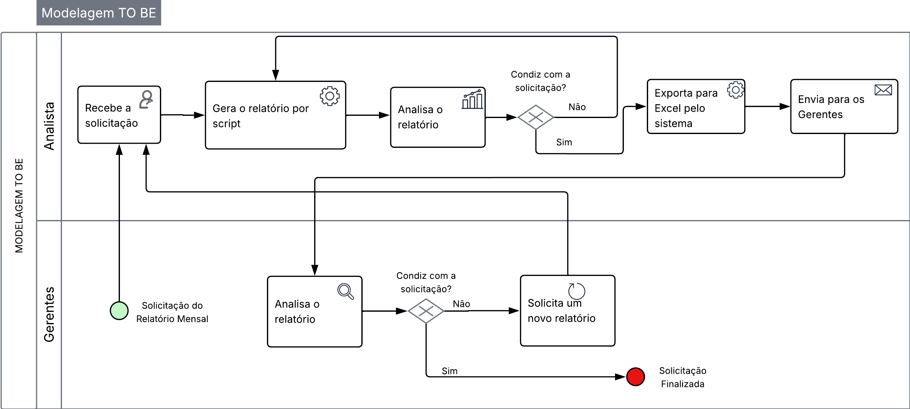

## 3.3.4 Processo 2 – FLUXO DE RELATORIOS INTERNOS (TO BE)

_O diagrama abaixo descreve o fluxo da extração automatizada para geração de relatórios, o fluxo integra todas as funcionalidades em um único local, afim  de melhorar a eficiência dos processos._
 

### Detalhamento das atividades no modelo TO BE 

Nesse fluxo, o analista irá receber a demanda com todas as informações necessárias para gerar o relatório solicitado, posteriormente irá selecionar quais informações serão utilizadas e qual o período de tempo ele deseja receber as informações. Um script automatizado gera o relatório automaticamente para o analista, que nesse momento irá analisar o relatório recebido gerado para planilha de Excel. Após esse processo, ele encaminha o relatório para o solicitante e assim se encerra a demanda.

O fluxo envolve dois atores principais:

- **Gerentes (Solicitante)**: Recebe os relatórios mensalmente.

- **Analista de Atendimento**: Recebe a solicitação e gera o relatório.

### Fluxo do Processo

**Informações dos Relatórios**

As informações necessária para o relatórios serão adicionadas ao chamado que o solicitante abrir pelo TrackIT.

**Gerar Relatório**

O analista irá receber a solicitação pelo TrackIT e executar o script automatizado com base nas informações do solicitante.

**Análise do Relatório**

Com o relatório em mãos, o analista irá analisá-lo para certificar-se de que não esqueceu de nenhuma informação.

**Tratamento do Relatório**

Após concluir que o relatório está correto, o analista irá tratar o relatório para que ele esteja corretamente convertido e formatado em uma planilha de Excel.

**Encaminhamento do Relatório**

Através do chamado aberto pelo solicitante, o analista irá encaminha o arquivo em formato .xlsx para o mesmo.

**Encerramento do Chamado**

Com o arquivo em mãos, o solicitante irá analisá-lo e retornar um feedback para o analista, sendo positivo o chamado é encerrado, se necessário alguma alteração será possível trocar mensagens pelo próprio chamado para acertar os detalhes que esstiverem errados.

### Identificação de melhorias no Processo Futuro (TO BE)

**1. Centralização da Solicitação e Informações**

– Todas as informações necessárias são adicionadas diretamente ao chamado no TrackIT, centralizando a comunicação e garantindo que os dados estejam vinculados à solicitação.

**2. Eliminação da Análise Manual das Informações**

– As informações necessárias são inseridas diretamente no sistema pelo solicitante, simplificando o trabalho do analista e reduzindo o risco de erros de interpretação.

**3. Geração Automatizada do Relatório e Pré-Visualização:**

– O analista irá executar o script com base nos parâmetros informados pelo usuáriono TrackIT e visualizar o resultado obtido.

**4. Facilidade de Alteração e Correção**

– Permite que o analista analise a prévia do relatório antes de enviar, trazendo simplicidade ao processo.

**5. Tratamento Automatizado do Relatório**

– O próprio script dentro do sistema converte o relatório para planilha Excel, economizando tempo do analista e eliminando o risco de erros na transferência manual.

**6. Comunicação e Feedback Integrados**

–  O relatório é encaminhado através do próprio chamado no sistema, e o feedback do solicitante também é registrado no mesmo local, facilitando a comunicação e o rastreamento do status da solicitação. A possibilidade de troca de mensagens dentro do chamado para acertar detalhes agiliza a resolução de problemas.

**7. Redução do Ciclo de Retrabalho**

–  A centralização das informações, a geração automatizada, a facilidade de correção e a comunicação integrada diminuem a probabilidade de erros e agilizam a identificação e correção de problemas, evitando que o analista precise retornar ao início do processo com frequência.

### Consequências dos ganhos identificados

- **Redução significativa do trabalho manual do analista**
- **Diminuição da probabilidade de erros humanos**
- **Aceleração do processo de geração e entrega de relatórios**
- **Melhora na comunicação e no rastreamento das solicitações**
- **Otimização do tempo do analista para tarefas mais estratégicas**

##