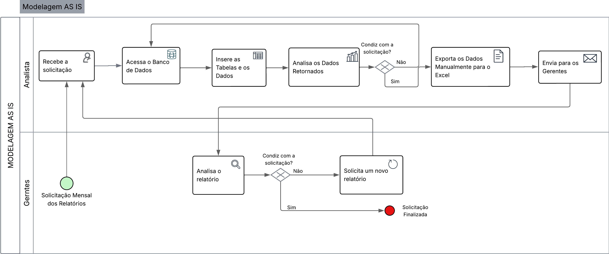

### 3.3.2 Processo 2 – FLUXO DE RELATORIOS INTERNOS
O diagrama abaixo motra o fluxo atual da produção de relatórios, logo após será mostrado como um sistema automatizado, centralizando as funcionalidades, pode aprimorar a eficiência dos processos.

Detalhamento das atividades no modelo AS IS

Atualmente, a geração dos relatórios ocorre de forma manual, na qual o analista possuem algumas informações previamente definidas dos relatórios de cada gerente e ir manualmente no banco de dados inserir as tabelas e os dados necessários, analisar os dados retornados, tratar os dados para que eles sejam passados para uma planilha Excel e aí sim enviados manualmente para todos os gerentes interessados em cada relatório.Essa abordagem resulta em ineficiência, retrabalho, grande risco de conflinto de informações e dificuldades para atender todas as solicitações.

O fluxo envolve dois atores principais:

- **Gerentes (Solicitante)**: Recebe os relatórios mensalmente.

- **Analista de Atendimento**: Recebe a solicitação e gera o relatório.

### Fluxo do Processo

**Informações dos Relatórios**

As informações dos relatórios já são pré-definidas pelos gerentes, podendo haver ou não alteração, no qual caso haja, o gerente solicitante deve enviar un email para para a caixa de entrada da ASTIN e informá-los dessa alteração. A maior problema disso é que caso a troca de informações sobre essa alteração não seja clara e objetiva, haverá um desgaste tanto por parte do analista, por ter que refazer todos os processos novamente. quanto do gerente que fez a solicitação por receber um relatório incompleto e ter que aguardar por mais tempo até que um novo seja gerado.

**Análise das Informações**

O analista terá que analisar todas as informações solicitadas no relatório para que assim ele saiba quais tabelas, colunas e dados ele terá que buscar no banco para que ele consiga obter os dados necessários. Como essa análise é feita de forma manual, erros de interpretação ou mesmo de buscas no banco podem ocorrer, tornando um processo cansativo e necessário de alta cautela para minimizar os possíveis erros.

**Acesso ao Banco de Dados**

Após a análise das informações, o analista acessa o Banco de Dados e realiza manualmente todas as consultas necessárias, informando quais tabelas, períodos e dados específicos serão necessários, para assim obter os dados que serão utilizados no relatório. 

**Análise dos Dados Retornados**

Após feitas todas consultas necessárias, o analista precisa realizar uma análise dos dados que possuem e ver se eles são o que se esperava para que possam ser adicionados nos relatórios. Caso ele entenda que os dados retornados não são os dados que ele precisa, ele terá que refazer todo o processo de análise novamente e posteriormente todos os processos de consulta até que os dados obtidos sejam os que ele precisa ter para o gerar o seu relatório.

**Tratamento dos Dados**

Após o analista ter a confirmação de que os dados retornados estão corretos para o relatório, ele faz o tratamento manual desses dados passando-os para uma tabela em Excel e posteriormente enviá-los ao gerente solicitante. O problema disso é que se torna um trabalho redundante e de desgaste, tomando uma grande parte do tempo do analista em um processo que não deveria demorar tanto.

**Envio do Relatório**

Após concluído todos os processos anteriores, o analista envia por email o relatório gerado para o gerente e fica no aguardo de uma resposta do mesmo.

**Análise do Gerente**

Antes do gerente analisar o relatório em si, ele precisa analisar as informações que estão contidas nele, quando as informações são as que se eram esperadas, o gerente fornece um feedback positivo ao analista e assim a solicitação se encerra, caso contrário, ele envia um novo email com as informações que precisam ser alteradas, adicionadas ou excluídas, e assim o analista volta para o primeiro processo, Análise das Informações.

### Identificação de Gargalos no Processo Atual (AS-IS)

**1. Comunicação via E-mail para Alterações**

- A dependência de e-mails para comunicar alterações nas informações dos relatórios é um ponto de atrito. Se a comunicação não for clara e objetiva nesses e-mails, ocasiona em um retrabalho significativo tanto para o analista quanto para o gerente.
- Se as informações pré-definidas não forem revisadas e atualizadas frequentemente, podem ser gerados relatórios que não atendem mais às necessidades dos gerentes.

**2. Análise Manual das Informações**

- A análise manual das informações solicitadas pode ocasionar erros de interpretação por parte do analista, o que resulta em buscas incorretas no banco de dados.
- Analisar manualmente cada solicitação de relatório para identificar tabelas, colunas e dados é um processo repetitivo e que consome tempo valioso do analista.
- A ausência de um guia ou ferramenta para auxiliar na identificação dos dados necessários pode levar a inconsistências na forma como diferentes analistas abordam a mesma solicitação.

**3. Acesso Manual ao Banco de Dados**

- Realizar consultas manualmente no banco de dados é um processo lento e propenso a erros de digitação ou na seleção de tabelas e campos.
- A eficiência do acesso ao banco de dados depende do conhecimento específico de cada analista sobre a estrutura do banco e as consultas necessárias.

**4. Análise Manual dos Dados Retornados do Banco**

- A necessidade de analisar manualmente os dados retornados para verificar sua adequação é demorada e pode levar a erros na identificação de dados incorretos.
- Se os dados retornados não forem os esperados, o analista precisa refazer todo o processo, desde a análise das informações até a consulta ao banco de dados, gerando um ciclo de retrabalho significativo.

**5. Tratamento Manual dos Dados**

- Transferir manualmente os dados do banco para uma planilha Excel é uma tarefa repetitiva, consumindo tempo que poderia ser dedicado a análises mais complexas.
- A manipulação manual dos dados aumenta o risco de erros de digitação ou formatação.

**6. Tratamento Manual dos Dados**
- O tempo gasto no envio do relatório por e-mail e na posteriormente na análise do gerente pode atrasar a identificação de problemas ou informações incorretas.
- Caso o gerente solicite alterações, o analista precisa retornar ao início do processo ("Análise das Informações"), criando um ciclo de espera e retrabalho.

### Consequências dos Gargalos Identificados

- Comunicação ineficiente e não padronizada para alterações nas informações dos relatórios.
- Processos manuais e repetitivos na análise das informações, acesso ao banco de dados e tratamento dos dados.
- Grnde número de potenciais erros humanos em diversas etapas do processo.
- Ciclos de retrabalho significativos devido a informações incorretas ou mal interpretadas.
- Dependência excessiva da intervenção manual do analista em cada etapa.

## 3.3.2 Processo 2 – RELATÓRIOS

_O diagrama abaixo descreve o fluxo do sistema automatizado para geração de relatórios, o sistema integra todas as funcionalidades em um único local, afim  de melhorar a eficiência dos processos._
 

### Detalhamento das atividades no modelo TO BE 

Nesse sistema, o analista irá receber a demanda com todas as informações necessárias para gerar o relatório solicitado, posteriormente irá selecionar no sistema quais informações serão utilizadas e qual o período de tempo ele deseja receber as informações. O sistema gera o relatório automaticamente para o analista, que nesse momento irá analisar o relatório recebido, podendo alterar as informações dentro do próprio sistema para que um novo relatório seja gerado caso algo estivesse errado. Após verificar que tudo está correto, o analista poderá usar uma funcionalidade dentro do prórpio sistema para transformar esse relatório em uma planilha Excel. Após esse processo, ele encaminha o relatório para o solicitante e assim se encerra a demanda.

O fluxo envolve dois atores principais:

- **Gerentes (Solicitante)**: Recebe os relatórios mensalmente.

- **Analista de Atendimento**: Recebe a solicitação e gera o relatório.

### Fluxo do Processo

**Informações dos Relatórios**

As informações necessária para o relatórios serão adicionadas ao chamado que o solicitante abrir pelo sistema.

**Gerar Relatório**

O analista irá acessar a aplicação dentro do próprio sistema e adicionar as informações que estiverem no chamado na própria e realizar a geração do relatório, após isso, o sistema retornará uma janela com uma prévia do relatório.

**Análise do Relatório**

Com o relatório em mãos, o analista irá analisá-lo para certificar-se de que não esqueceu de nenhuma informação, caso seja necessário, o sistema lhe fornecerá uma maneira para que ele possa fazer as alterações necessárias.

**Tratamento do Relatório**

Após concluir que o relatório está correto, o analista irá tratar o relatório para que ele seja convertido em uma planilha de Excel pela própria aplicação.

**Encaminhamento do Relatório**

Através do chamado aberto pelo solicitante, o analista irá encaminha o arquivo em formato .xlsx para o mesmo.

**Encerramento do Chamado**

Com o arquivo em mãos, o solicitante irá analisá-lo e retornar um feedback para o analista, sendo positivo o chamado é encerrado, se necessário alguma alteração será possível trocar mensagens pelo próprio chamado para acertar os detalhes que esstiverem errados.

### Identificação de melhorias no Processo Futuro (TO BE)

**1. Centralização da Solicitação e Informações**

– Todas as informações necessárias são adicionadas diretamente ao chamado no sistema, centralizando a comunicação e garantindo que os dados estejam vinculados à solicitação.

**2. Eliminação da Análise Manual das Informações**

– As informações necessárias são inseridas diretamente no sistema pelo solicitante, simplificando o trabalho do analista e reduzindo o risco de erros de interpretação.

**3. Geração Automatizada do Relatório e Pré-Visualização:**

– O analista utiliza uma aplicação dentro do sistema para gerar o relatório com base nas informações do chamado, e o sistema fornece uma prévia, agilizando o processo e minimizando a necessidade de conhecimento técnico aprofundado do banco de dados.

**4. Facilidade de Alteração e Correção**

– Permite que o analista analise a prévia do relatório e, se necessário, faça alterações diretamente na aplicação, tornando o processo de correção mais rápido e eficiente.

**5. Tratamento Automatizado do Relatório**

– A própria aplicação dentro do sistema converte o relatório para planilha Excel, economizando tempo do analista e eliminando o risco de erros na transferência manual.

**6. Comunicação e Feedback Integrados**

–  O relatório é encaminhado através do próprio chamado no sistema, e o feedback do solicitante também é registrado no mesmo local, facilitando a comunicação e o rastreamento do status da solicitação. A possibilidade de troca de mensagens dentro do chamado para acertar detalhes agiliza a resolução de problemas.

**7. Redução do Ciclo de Retrabalho**

–  A centralização das informações, a geração automatizada, a facilidade de correção e a comunicação integrada diminuem a probabilidade de erros e agilizam a identificação e correção de problemas, evitando que o analista precise retornar ao início do processo com frequência.

### Consequências dos ganhos identificados

- **Redução significativa do trabalho manual do analista**
- **Diminuição da probabilidade de erros humanos**
- **Aceleração do processo de geração e entrega de relatórios**
- **Melhora na comunicação e no rastreamento das solicitações**
- **Otimização do tempo do analista para tarefas mais estratégicas**
